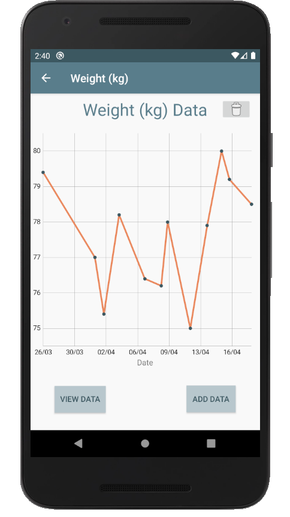
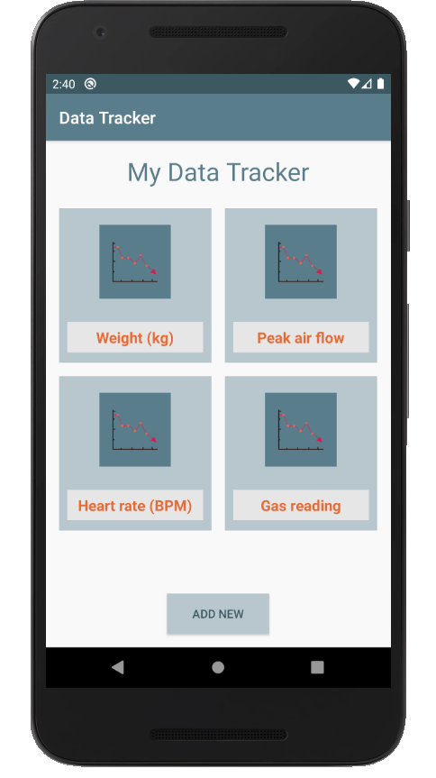
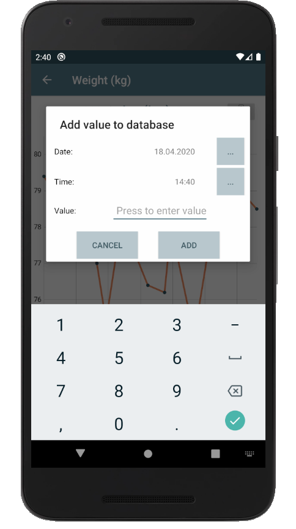
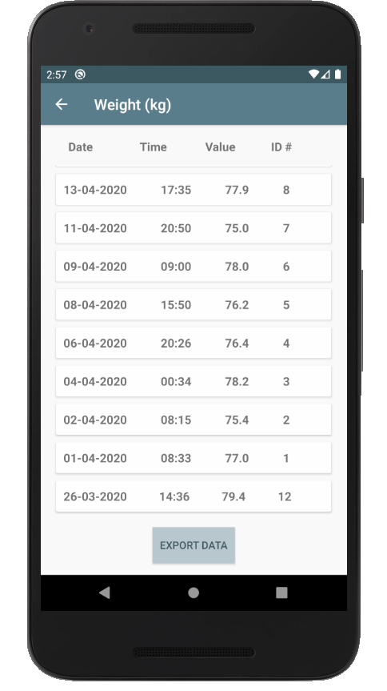
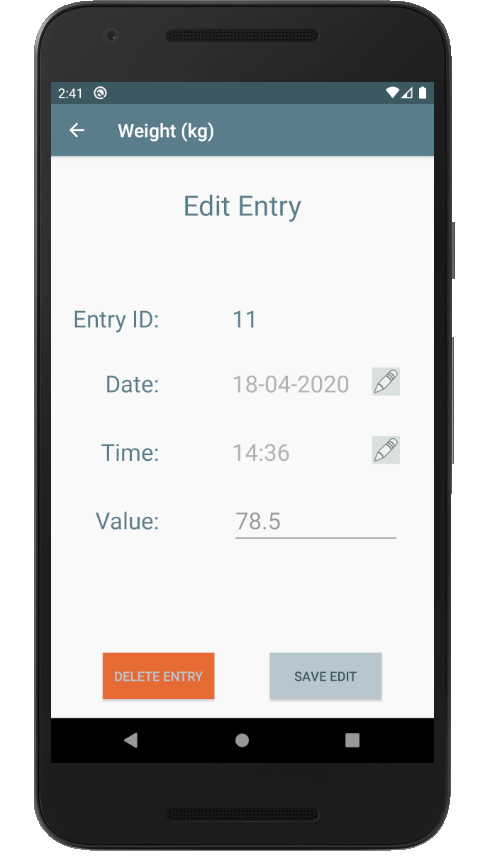

# Data Tracker (android)

 

Android app to record and display manually measured data.

This was initially developed as an educatioinal excercise to learn android programming using Kotlin and Android Studio. The idea arose as I wanted to track my weight during the Covid-19 lockdown 2020.

The app allows multiple datasets to be recorded by manually entering a value and a time.

The data is stored using SQLite. The indiviual entires can be modified after adding. The data can be exported as an csv file and sent via email.

The data is plotted using the MPAndroidchart library (https://github.com/PhilJay/MPAndroidChart).

## Installation:
I have not learnt how to make apk files yet. My current method is to upload to a phone via USB debugging mode using Android Studio. 

## Screenshots:

